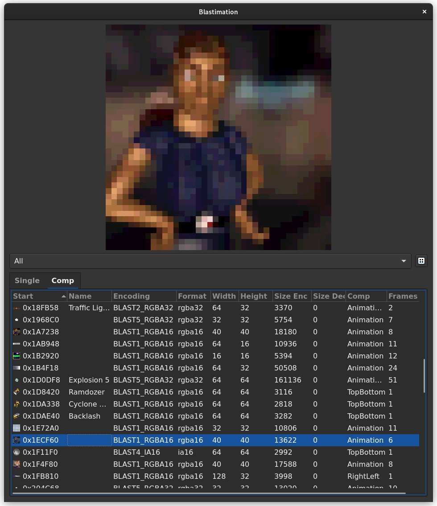
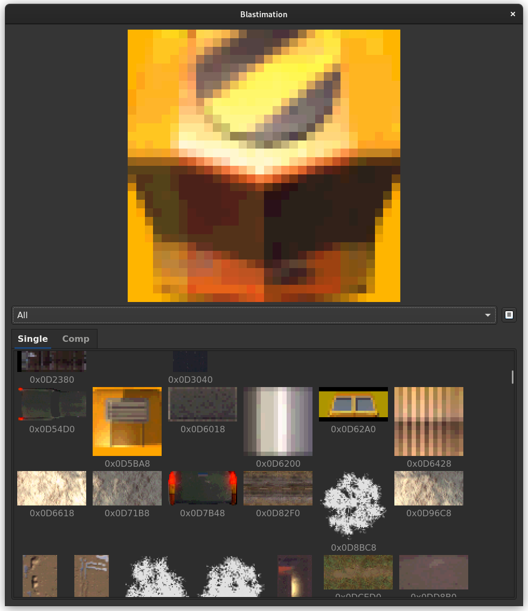
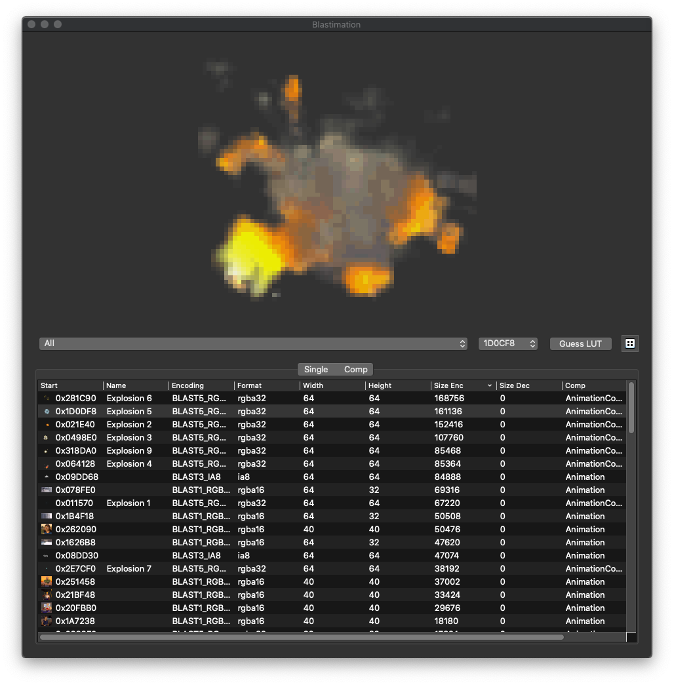
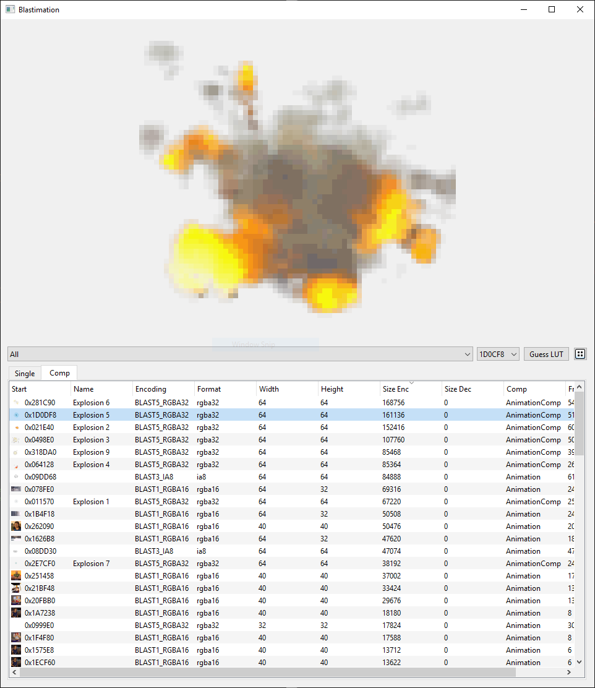

# Blastimation

A texture and animation viewer for Blast Corps written in Python and Qt.


## Set up Python env

```bash
virtualenv .env
. .env/bin/activate
pip install -r requirements.txt
```

## Run

```bash
# Load from splat yaml
python -m blastimation blastcorps.us.v11.assets.yaml

# Load from rom (broken resolutions)
python -m blastimation baserom.us.v11.z64
```

## Run commands

```bash
python -m blastimation.commands.export_gifs
python -m blastimation.commands.list_sequence 0x21BF48 0x2237E8
```

## Run tests

```bash
python -m unittest
```

## Screenshots

### List view


### Icon view


### macOS


### Windows

